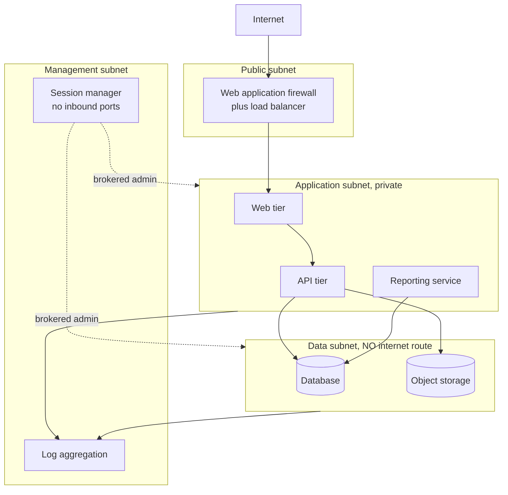

# SEC-03: Domain 3, Security Architecture
### Keystone Grants Management System (KGMS) | 18 percent of the exam

> ### PORTFOLIO EXERCISE, SIMULATED SYSTEM
> **Keystone Grants Management System (KGMS) does not exist.** The Federal Workforce Development Agency (FWDA) is a fictional federal
> agency invented for this portfolio. Every organisation, person, system
> identifier, network address, finding, date and signature on this page is
> fabricated for training purposes, with one exception: the author, Nkeiru Sarah Adesida, is a real person. Where her name appears in a scenario role, that role is fictional, and she has never worked for this agency, which does not exist. Nothing here is drawn from any real
> employer, client or government system, and no real document, artifact or
> data has been reproduced. This file is coursework, not a government record.

---

**Document:** Security+ SY0-701 3.0 Security Architecture, applied to KGMS  
**Simulated system:** Keystone Grants Management System (KGMS) | `FWDA-KGMS-2026-MOD`  
**Framework and standards:** CompTIA Security+ SY0-701 Domain 3.0, 18 percent of the exam. Mapped to NIST SP 800-53 Rev 5  
**Author:** Nkeiru Sarah Adesida  
**Document date:** 5 September 2026  
**Status:** Complete

**Navigation:** [<- SEC-02: Domain 2, Threats, Vulnerabilities and Mitigations](../sec-02-threats-vulnerabilities-mitigations/README.md) &nbsp;|&nbsp; [Repository home](../README.md) &nbsp;|&nbsp; [SEC-04: Domain 4, Security Operations ->](../sec-04-security-operations/README.md)

---

## Purpose

Domain 3 is how the system is built, at 18 percent of the exam. Architecture decisions are
the controls you only get to make once, and they are the ones that keep working when the
operational controls lapse.

Plain language version: you can hire more guards, or you can build the building with fewer
doors. Domain 3 is the second one.

---

## Section 1: Architecture model and its trade offs

KGMS is an agency managed application on an authorised Infrastructure as a Service
platform. That choice has consequences worth naming rather than assuming.

| Model | Who runs what | What the agency inherits | What the agency still owns |
|---|---|---|---|
| On premises | Agency runs everything | Nothing | Everything, including physical security and hardware |
| **Infrastructure as a Service, used here** | Provider runs the facility, hardware and hypervisor | Physical and environmental controls, hardware maintenance, media sanitisation | Guest operating systems, patching, configuration, application, data, identity |
| Platform as a Service | Provider also runs the operating system and runtime | The above plus operating system patching | Application, data, identity, configuration |
| Software as a Service | Provider runs the application | Almost everything technical | Data, identity, configuration of what the provider exposes |

### The shared responsibility mistake this architecture invites

Inheriting physical controls is straightforward. The dangerous ones are **shared** controls,
where both parties own part and each part needs its own evidence.

The classic failure: recording flaw remediation, SI-2, as inherited because "the cloud
provider patches". The provider patches the hypervisor. **The agency patches its own guest
operating systems and application dependencies.** An agency that records that control as
inherited produces no patching evidence at all, and discovers the gap when an assessor asks.

Of the controls sampled in this system's responsibility matrix, a third are shared, and every
one carries a written split.

---

## Section 2: Network architecture

| Decision | What it is | Why it was made |
|---|---|---|
| Three tier segmentation | Public, application and data subnets with controlled paths between them | Compromise of the public tier does not reach the data tier directly |
| **No internet route from the data subnet** | No NAT gateway, no internet gateway. Package updates arrive through a private endpoint | A compromised application instance cannot exfiltrate directly from the data tier to an external host. This is the strongest single control in the architecture |
| **No bastion host with an open port** | Administrative access brokered through a session manager service | Nothing in the boundary listens for an inbound administrative connection, so there is no SSH port to attack or to misconfigure |
| Web application firewall in front of everything public | Rules tuned to the application's own routes | Blocks known attack patterns before they reach application code |
| Security groups default deny | Explicit allow only for required paths | Lateral movement requires an explicit rule to exist |
| Multi availability zone deployment | Compute and database across zones | Availability, which is rated Moderate |

### Why no bastion host is the decision worth explaining in an interview

The conventional pattern is a hardened jump host with SSH open to a restricted address range.
It works, and it has three standing weaknesses: the port is reachable and therefore
attackable, the address restriction is a configuration somebody can widen, and session
activity is only as well recorded as the host's own logging.

Brokering through a session manager removes the port entirely. There is nothing to scan,
nothing to misconfigure, and every session is recorded by the platform rather than by the
host being administered. This is why the AC-17 remote access control is recorded as tailored
rather than implemented as specified: the control objective is met by architecture instead of
by VPN configuration, and the tailoring statement has to argue that the alternative is at
least as strong.

---

## Section 3: Data protection

| Data state | Protection | Detail |
|---|---|---|
| At rest | AES-256 GCM, customer managed key | Agency controls key policy, rotation and who may decrypt. Every key use logged |
| In transit, external | TLS 1.2 minimum | All public paths |
| In transit, internal | TLS between tiers | Service to service authentication with internal certificates |
| In transit, payment path | Mutual TLS | Both ends authenticated |
| In use | Access control and logging | No confidential computing. In use protection is a control gap, honestly stated |
| Backup | Encrypted, 35 day retention, cross region replication | Secondary region key control remediation is tracked as POA-007 |

### Data classification and the minimisation decision

| Classification | Examples on this system | Handling |
|---|---|---|
| Public | Funding opportunity announcements, published award amounts | No confidentiality controls. Integrity matters, because a falsified announcement misdirects applicants |
| Internal | System documentation, configuration records | Agency access only |
| Confidential | Applicant and reviewer personal information, unpublished merit scores, deliberations | Role restricted, encrypted, access logged |
| Restricted | Payment instruction records | Confidential controls plus segregation of duties and daily reconciliation |

**The most effective data protection control on this system is not technical.** The privacy
impact assessment limited collection to what the grant process requires, so several data
elements that could have been collected are simply not held. Data that does not exist cannot
be breached, and no amount of encryption is as strong as absence.

---

## Section 4: Resilience and recovery

| Element | Implementation | Verified? |
|---|---|---|
| Multi availability zone | Compute and database across zones | Yes, by architecture |
| Backup | Nightly automated, 35 day retention | Yes, backup jobs evidenced |
| Cross region replication | Snapshots replicated to a secondary region | Yes |
| Recovery time objective | 4 hours | **No. This is the problem, see below** |
| Recovery point objective | 24 hours, from nightly backup | Partially, backup timing evidenced |
| Contingency plan | Documented, updated 31 July 2026 | Document exists |
| Functional restore test | Restore into an isolated subnet with integrity verification | **Never performed.** Scheduled 15 September 2026, tracked as POA-005 |

### The honest statement about recovery

**Backups run, replicate and are encrypted. Nobody has ever restored from them.**

That means the documented four hour recovery time objective is a number in a document, not a
measured capability. An untested backup is a belief, and the belief has never been challenged.

The Authorizing Official refused to accept a tabletop exercise as a substitute, which is
correct: **a tabletop cannot measure a recovery time.** It can test whether people know the
plan. It cannot tell you how long a restore takes.

The success criterion set for that test is worth noting: publish the measured recovery time,
**or revise the objective**. If the restore takes six hours against a four hour objective, the
honest outcome is a revised objective, not a repeated test until a good number appears.

---

## Section 5: Architecture decisions ranked by what they actually bought

| Decision | Risk it addresses | Strength |
|---|---|---|
| Data subnet with no internet route | Exfiltration after application compromise | Highest. It is structural and cannot lapse |
| No inbound administrative port | Remote access attack and misconfiguration | High. Removes the surface rather than defending it |
| Federated identity, no local password store | Credential compromise | High. There is no password database to steal |
| Immutable instances rebuilt from images | Configuration drift and persistence | High. An attacker's changes do not survive a rebuild |
| Infrastructure as code with peer review | Misconfiguration, the most common cloud incident cause | High |
| Three tier segmentation | Lateral movement | Moderate to high |
| Customer managed encryption keys | Key governance, insider access to stored data | Moderate. It failed in the secondary region, which shows it depends on configuration rather than structure |

### The point of that ranking

The top four are **structural**: they hold whether or not anybody is paying attention this
month. The last one depends on somebody configuring it correctly in every region, and it is
the one that failed.

Architecture controls that require ongoing correctness are operational controls wearing an
architectural label. When you can choose, choose the control that cannot lapse.

---

**Navigation:** [<- SEC-02: Domain 2, Threats, Vulnerabilities and Mitigations](../sec-02-threats-vulnerabilities-mitigations/README.md) &nbsp;|&nbsp; [Repository home](../README.md) &nbsp;|&nbsp; [SEC-04: Domain 4, Security Operations ->](../sec-04-security-operations/README.md)

---

*Author: Nkeiru Sarah Adesida, Information System Security Officer (ISSO), portfolio scenario*  
*Simulated system: Keystone Grants Management System (KGMS) | FWDA-KGMS-2026-MOD*  
*This document is a portfolio exercise built on a fictional organisation. It is not a government record.*  
*[GitHub portfolio](https://github.com/Nkee07) | [LinkedIn](https://www.linkedin.com/in/nkeiru-adesida-grc)*
